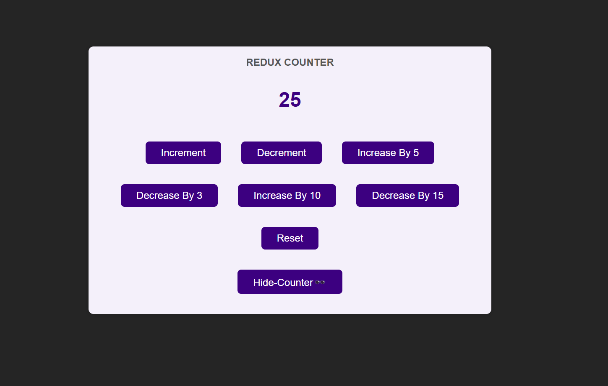

# Redux Before RTK 🪝⚛️
### **Redux State Management – Theoretical Overview**

---

### **What is Redux?**

Redux is a state management library for JavaScript applications that helps manage the global state in a predictable way. It provides a structured approach to manage and update the application’s state consistently, especially in complex apps where multiple components need access to shared data.

---

### **Why is State Management Needed?**

In modern web applications:
1. **State** (data) is dynamic and shared across components.
2. When the state changes, the UI must be updated.
3. Managing complex state manually can lead to inconsistencies, bugs, and performance issues.

State management tools like **Redux** centralize the state and make it predictable and easier to debug.

---

### **Core Concepts of Redux**

#### 1. **State**
The **state** in Redux is a **single source of truth** stored in a **centralized store**. It represents the data at any point in time for the entire application.  
- It is usually structured as a JavaScript object.

---

#### 2. **Actions**
Actions are **plain JavaScript objects** that describe an event or user interaction. They tell Redux **what should happen** (e.g., add a product, increment a counter).  
- Each action has a **type** property to identify the action.  
- They are the **only way** to communicate with the store to update the state.

---

#### 3. **Reducers**
A **reducer** is a pure function that takes two inputs:
1. **Current State**
2. **Action**

The reducer processes the action and returns a **new state**.  
- Reducers must be pure, meaning they do not modify the original state; instead, they return an updated copy.

---

#### 4. **Store**
The **store** is a centralized place where the entire application's state is stored. It acts as a bridge between the state, actions, and reducers.  
The store allows you to:
- **Access** the current state.
- **Dispatch** actions to update the state.
- **Subscribe** to listen for state changes.

---

#### 5. **Dispatch**
The **dispatch** function is used to send actions to the reducer. It is the mechanism that triggers a state update.  
When an action is dispatched:
1. The action is passed to the reducer.
2. The reducer updates the state.
3. The store notifies subscribers about the state change.

---

#### 6. **Subscriptions**
Components can **subscribe** to the store to listen for state updates. When the state changes, subscribed components are notified and can re-render based on the new state.

---

### **Redux Data Flow**

The Redux flow follows a unidirectional data flow:
1. **Action** → Describes an event (e.g., user clicked a button).
2. **Dispatch** → Sends the action to the store.
3. **Reducer** → Processes the action and returns the updated state.
4. **Store** → Updates the state and notifies subscribers.
5. **View** → React components (or any UI) re-render based on the new state.

This predictable, one-way flow ensures consistency.

---

### **Advantages of Redux**

1. **Single Source of Truth**: The state is stored in a centralized location, making it easier to debug and manage.
2. **Predictability**: State changes are predictable because they follow a clear flow through actions and reducers.
3. **Improved Debugging**: Tools like Redux DevTools allow time-travel debugging (inspect past states).
4. **Scalability**: Redux scales well for large applications with complex state requirements.
5. **State Persistence**: State can persist across page reloads or be saved to local storage.

---

### **Disadvantages of Redux**

1. **Boilerplate Code**: Requires writing additional code like actions, reducers, and setting up the store.
2. **Learning Curve**: New developers might find Redux concepts challenging to understand.
3. **Overhead**: For small applications, Redux can be overkill as the state might be easy to manage locally.

---

### **When to Use Redux**

Redux is ideal for applications where:
1. **State** needs to be shared across multiple components.
2. Components frequently re-render due to state changes.
3. Predictability and debugging are critical.
4. The application state is complex (e.g., authentication, cart management, forms).

---

### **Conclusion**

Redux provides a systematic way to manage the state in JavaScript applications. By centralizing the state, enforcing predictable state updates, and following a unidirectional data flow, Redux helps ensure consistency, scalability, and ease of debugging. It is especially useful for large-scale applications where local component state management becomes insufficient.
## The Basic Structure
```js
const redux = require("redux");

const counterReducer = (state = { counter: 0 }, action) => {
  if (action.type === "increment") {
    return {
      counter: state.counter + 1,
    };
  }
  if (action.type === "decrement") {
    return {
      counter: state.counter - 1,
    };
  }
  return state;
};

const store = redux.createStore(counterReducer);
//console.log(store.getState());

function counterSubscriber() {
  const latestState = store.getState();
  console.log(latestState);
}

store.subscribe(counterSubscriber);

store.dispatch({ type: "increment" });
store.dispatch({ type: "decrement" });

// { counter: 1 }
// {counter: 0}
```
## Proper Application
```js
//creating a store
//creating a reducerFx
//wrapping it around the topmost or parent component
//dispatching them in respective components and files


//src/store/index.js
import { createStore } from "redux";

const initialState = {
  counter: 0,
  showCounter: false,
};

const counterReducer = (state = initialState, action) => {
  if (action.type === "increment") {
    return {
      counter: state.counter + 1,
      showCounter: state.showCounter,
    };
  }
  if (action.type === "decrement") {
    return {
      counter: state.counter - 1,
      showCounter: state.showCounter,
    };
  }
  if (action.type === "reset") {
    return {
      ...state,
      counter: 0,
    };
  }
  if (action.type === "increase") {
    return {
      ...state,
      counter: state.counter + action.payload,
      //or counter: state.counter + action.amount, //any name consistent name
    };
  }
  if (action.type === "decrease") {
    return {
      ...state,
      counter: state.counter - action.payload,
    };
  }
  if (action.type === "toggle_counter") {
    return {
      counter: state.counter,
      showCounter: !state.showCounter,
    };
  }
  return state;
};
const store = createStore(counterReducer);

export default store;
```
```js
//src/index.js
import React from "react";
import ReactDOM from "react-dom/client";
import { Provider } from "react-redux";
import "./index.css";
import App from "./App";
import store from "./store";

const root = ReactDOM.createRoot(document.getElementById("root"));
root.render(
  <Provider store={store}>
    <App />
  </Provider>
);
```
```js
//src/components/Counter.js
import { useDispatch, useSelector } from "react-redux";
import classes from "./Counter.module.css";

const Counter = () => {
  const counter = useSelector((state) => state.counter);
  const show = useSelector((state) => state.showCounter);
  const dispatch = useDispatch();
  const toggleCounterHandler = () => {
    dispatch({ type: "toggle_counter" });
  };

  return (
    <main className={classes.counter}>
      <h1>Redux Counter</h1>
      {show && <div className={classes.value}>{counter}</div>}

      <div>
        <button onClick={() => dispatch({ type: "increment" })}>
          Increment
        </button>
        <button onClick={() => dispatch({ type: "decrement" })}>
          Decrement
        </button>
        <button onClick={() => dispatch({ type: "increase", payload: 5 })}>
          Increase By 5
        </button>
        <button onClick={() => dispatch({ type: "decrease", payload: 3 })}>
          Decrease By 3
        </button>
        <button onClick={() => dispatch({ type: "increase", payload: 10 })}>
          Increase By 10
        </button>
        <button onClick={() => dispatch({ type: "decrease", payload: 15 })}>
          Decrease By 15
        </button>
        <button onClick={() => dispatch({ type: "reset" })}>Reset</button>
      </div>
      <button onClick={toggleCounterHandler}>
        {show ? "Hide-Counter🕶️" : "Show-Counter🔍"}
      </button>
    </main>
  );
};

export default Counter;
```


### Related: Reference Vs Primitive Types in JS 🟡👨🏻‍💻
In JavaScript, data types are divided into **Primitive Types** and **Reference Types**. The key difference lies in how the data is stored in memory and how it is accessed.

Let’s go into detail about both:

---

# **Primitive Types**

Primitive types are the **basic building blocks** of data in JavaScript. They are **immutable** (cannot be changed) and are stored **directly in the memory**.

## **Characteristics of Primitive Types**
1. **Stored by value**: When you assign a primitive type to a variable, the **value itself** is stored in memory.
2. **Immutable**: You cannot modify the actual value; any operation on a primitive creates a **new value**.
3. **Independent copies**: If you copy a primitive, the new variable gets a **separate copy** of the value.

---

## **Primitive Data Types in JavaScript**
1. **Number**: Represents numeric values (e.g., `1`, `-3.5`, `2e3`).
2. **String**: Represents text data (e.g., `"Hello"`, `'World'`, \`JavaScript\`).
3. **Boolean**: Represents logical values (`true` or `false`).
4. **Undefined**: A variable that has been declared but **not initialized** (`let x;` → `x` is `undefined`).
5. **Null**: Represents the intentional absence of a value (`let y = null;`).
6. **Symbol**: A unique and immutable identifier introduced in ES6.
7. **BigInt**: Represents large integers beyond the `Number` type’s limits (`2n`, `9007199254740991n`).

---

### **Example of Primitive Types**

```javascript
let a = 10;      // Number
let b = a;       // Copy of 'a' is stored in 'b'

console.log(a, b); // Output: 10, 10

b = 20;          // Changing 'b' doesn't affect 'a'

console.log(a, b); // Output: 10, 20
```

### **Explanation**:
- `a` and `b` are independent copies of the value `10`.
- Modifying `b` does not affect `a`.

---

# **Reference Types**

Reference types are **objects** in JavaScript. Instead of storing the value itself, a **reference (address)** to the value in memory is stored.

## **Characteristics of Reference Types**
1. **Stored by reference**: Variables hold a reference (memory address) to the data, not the actual value.
2. **Mutable**: Objects and arrays can be changed without creating new references.
3. **Shared copy**: If you copy a reference type, both variables point to the **same memory location**.

---

## **Reference Data Types in JavaScript**
1. **Objects**: Collections of key-value pairs (e.g., `{ name: "John" }`).
2. **Arrays**: Ordered lists of values (e.g., `[1, 2, 3]`).
3. **Functions**: Callable pieces of code.
4. **Dates**: Represents dates and times.
5. **Other built-in objects**: Like `Map`, `Set`, `WeakMap`, etc.

---

### **Example of Reference Types**

```javascript
let obj1 = { name: "John", age: 30 }; // Object
let obj2 = obj1;                     // 'obj2' points to the same reference as 'obj1'

console.log(obj1, obj2);
// Output: { name: "John", age: 30 }, { name: "John", age: 30 }

obj2.name = "Doe"; // Modify 'obj2'

console.log(obj1, obj2);
// Output: { name: "Doe", age: 30 }, { name: "Doe", age: 30 }
```

### **Explanation**:
- `obj1` and `obj2` point to the same memory location.
- When you modify `obj2`, it affects `obj1` because both share the same reference.

---

# **Key Differences Between Primitive and Reference Types**

| **Aspect**                | **Primitive Types**                              | **Reference Types**                          |
|---------------------------|-------------------------------------------------|---------------------------------------------|
| **Storage**               | Stored **by value** directly in memory.         | Stored **by reference** (memory address).   |
| **Mutability**            | Immutable; cannot be modified directly.         | Mutable; properties can be changed.         |
| **Copying**               | Copies the actual value (independent copy).     | Copies the reference (shared copy).         |
| **Examples**              | Number, String, Boolean, Null, Undefined, etc.  | Objects, Arrays, Functions, Maps, etc.      |
| **Comparison**            | Compared by value (`===` checks value equality).| Compared by reference (`===` checks address).|

---

# **Demonstrating Comparison: Primitive vs Reference**

### **Primitive Comparison**
```javascript
let x = 5;
let y = 5;

console.log(x === y); // Output: true (values are equal)
```

### **Reference Comparison**
```javascript
let arr1 = [1, 2, 3];
let arr2 = [1, 2, 3];
let arr3 = arr1;

console.log(arr1 === arr2); // Output: false (different references)
console.log(arr1 === arr3); // Output: true (same reference)
```

### **Explanation**:
- `arr1` and `arr2` look identical but are stored in **different memory locations**, so they are not equal.
- `arr3` is assigned to `arr1` and shares the same reference, so they are equal.

---

# **Why Does This Matter?**

1. **Understanding behavior**: Knowing how primitives and references work avoids bugs, especially when working with objects or arrays.
2. **Cloning**:
   - For primitives: Simply assign the value.
   - For references: Use techniques like `spread operator`, `Object.assign`, or **deep cloning** libraries to avoid unwanted mutations.
3. **Performance**: Manipulating primitives is faster as they are simple and stored directly.

---

# **How to Clone Reference Types**

To avoid shared references, you can **clone** objects or arrays.

### **Shallow Clone**
Copies only the first level of properties.

```javascript
const obj = { name: "John", age: 30 };
const clone = { ...obj }; // Spread operator

clone.name = "Doe";
console.log(obj, clone);
// Output: { name: "John", age: 30 }, { name: "Doe", age: 30 }
```

### **Deep Clone**
Copies all levels of properties (for nested objects).

```javascript
const obj = { name: "John", nested: { age: 30 } };
const deepClone = JSON.parse(JSON.stringify(obj)); // Deep clone method

deepClone.nested.age = 25;
console.log(obj, deepClone);
// Output: { name: "John", nested: { age: 30 } }, { name: "John", nested: { age: 25 } }
```

---

# **Summary**

| **Primitive Types**                | **Reference Types**                     |
|------------------------------------|----------------------------------------|
| Stored by **value**.               | Stored by **reference**.               |
| Immutable.                         | Mutable.                               |
| Copying creates independent values.| Copying shares the same reference.     |
| Examples: Number, String, Boolean. | Examples: Objects, Arrays, Functions.  |

Understanding the distinction between **primitives** and **references** is crucial for managing data efficiently in JavaScript, especially when modifying or comparing values.